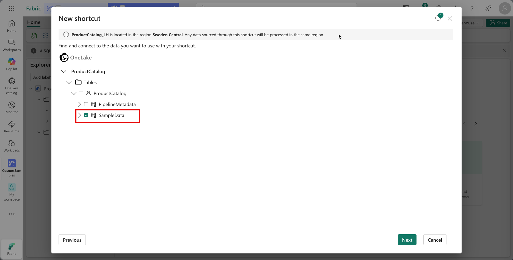
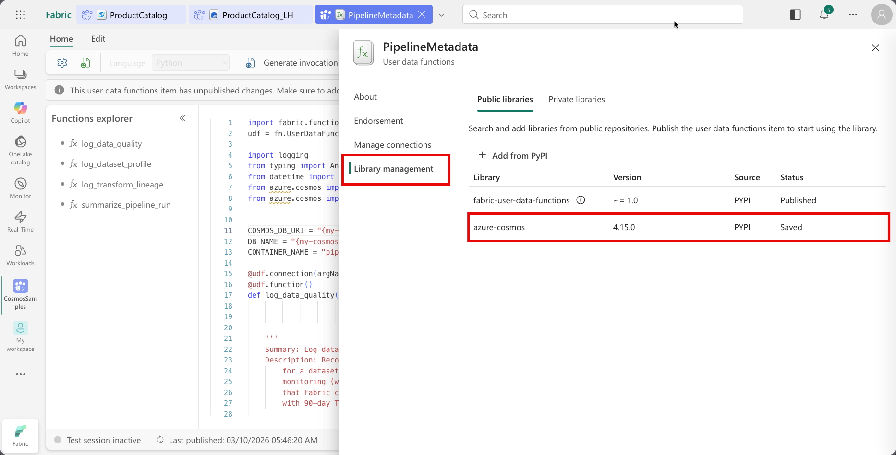
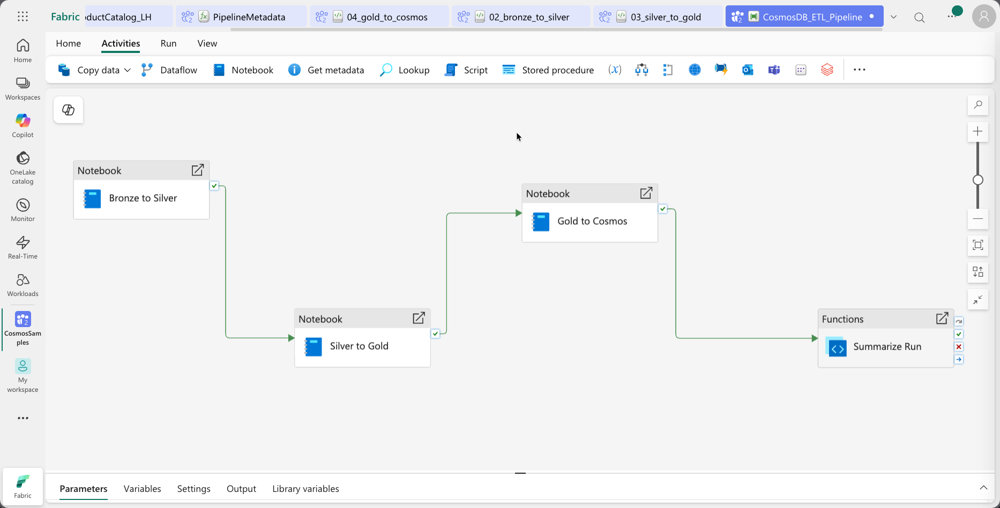
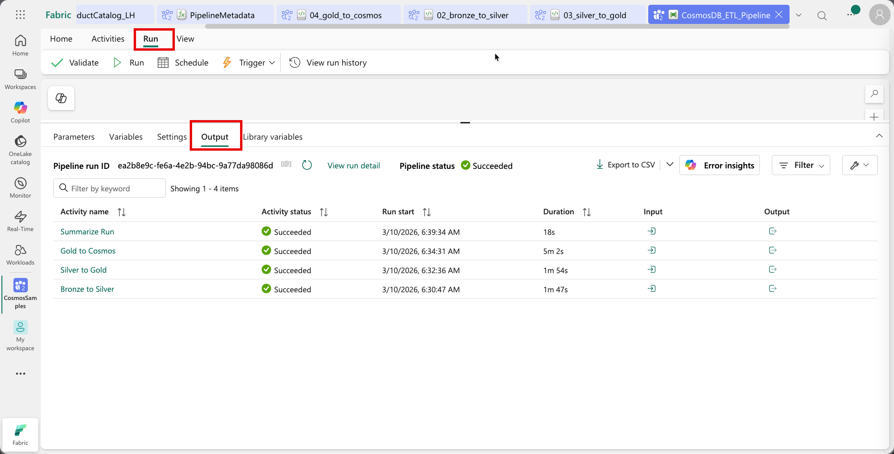
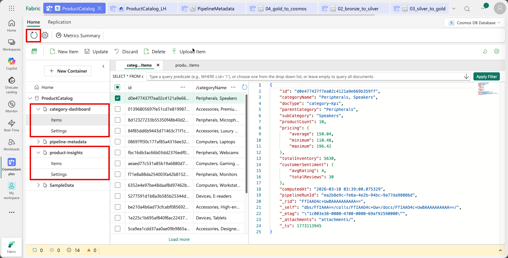

<!--
---
page_type: sample
languages:
- python
products:
- fabric
- fabric-database-cosmos-db
name: |
   Cosmos DB Data Pipeline with Reverse ETL
urlFragment: data-pipelines
description: Build a medallion pipeline (Bronze→Silver→Gold) in a Fabric Lakehouse using Cosmos DB sample data, then write enriched insights back to Cosmos DB (reverse ETL) with pipeline metadata logging.
---
-->

# 🔄 Cosmos DB Data Pipeline with Reverse ETL

## Cosmos DB → Lakehouse (Bronze → Silver → Gold) → Cosmos DB*

This sample builds a data pipeline using **Cosmos DB in Microsoft Fabric** and **Fabric Data Pipelines**. It demonstrates two key patterns:

1. **Reverse ETL** — Processed Gold-layer insights written back to Cosmos DB for operational serving
2. **Pipeline Metastore** — Data quality, dataset profiles, and transform lineage logged to Cosmos DB via User Data Functions

## 📖 Scenario

A product catalog team stores products and customer reviews in Cosmos DB. They need analytics (ratings, pricing trends, category KPIs) but also want those insights served back through their operational APIs with sub-10ms reads. The pipeline reads auto-mirrored Cosmos DB data via a Lakehouse shortcut (Bronze), cleans and separates mixed document types into Silver tables, builds a Gold star schema, and writes pre-aggregated product insight cards and category KPI documents back to Cosmos DB. Each notebook also logs data quality, dataset profiles, and transform lineage to a pipeline metastore in Cosmos DB via User Data Functions.

## 🎯 What You'll Learn

- **Lakehouse shortcuts** to Cosmos DB mirrored data (zero-ETL Bronze layer)
- **Medallion architecture** with PySpark (Bronze → Silver → Gold star schema)
- **Cosmos DB Spark connector** for writing data back to Cosmos DB
- **User Data Functions** for reusable pipeline metadata logging
- **Fabric Data Pipelines** orchestrating notebooks and functions

## 🗂️ Files

| File | Description |
| ------ | ------------- |
| `01_metastore_functions.py` | User Data Functions for logging data quality, profiles, and lineage to Cosmos DB |
| `02_bronze_to_silver.ipynb` | Splits mixed Bronze data into typed Silver tables (products, reviews, price history) |
| `03_silver_to_gold.ipynb` | Builds a star schema (dimensions + facts) from Silver tables |
| `04_gold_to_cosmos.ipynb` | Writes enriched product insights and category KPIs back to Cosmos DB |

## 🚀 Getting Started

### Step 1: Load Sample Data

1. In your Fabric workspace, create a **Cosmos DB** database (e.g., `ProductCatalog`)
1. Click **Sample data** to create a `SampleData` container and import the sample data into it.
1. Create a new container named `pipeline-metadata` in the same database to store pipeline metadata logged by the User Data Functions. The Partition Key for this container should be `/datasetId`.

### Step 2: Create Lakehouse Shortcut

1. In your Fabric workspace, create a **Lakehouse** (e.g., `ProductCatalog_LH`)
1. In the newly Lakehouse, create a new schema named `bronze` by right clicking the Lakehouse name in the left pane and selecting **New schema**.
1. Right click the `bronze` schema and select **New table shortcut**.
1. In the New shortcut dialog, select **Microsoft OneLake** as the source, select the auto-mirrored Cosmos DB Database `ProductCatalog`and the `SampleData` container to create a shortcut in the `bronze` schema.

   

### Step 3: Deploy User Data Functions

1. In your Fabric workspace, create a **User data functions** item named `PipelineMetadata`
1. On the User Data Function editor page, select New function and replace the default code with the contents of `01_metastore_functions.py`.
1. Replace the values of the following variables with actual values from your Cosmos DB database:

   ```python
      COSMOS_DB_URI = "{my-cosmos-artifact-uri}"
      DB_NAME = "{my-cosmos-artifact-name}"
   ```

1. From the top menu bar select **Library Management** > **+ Add from PyPI** and in the dropdown text box, search and select the `azure-cosmos` library and in the version dropdown, select the latest version

   

1. From the top menu bar select **Publish** to save and publish the User Data Functions.

### Step 4: Import Notebooks and Build Pipeline

1. In your Fabric workspace, from the top menu bar, select **Import > Notebook > From this computer** and upload the three notebooks:

   - `02_bronze_to_silver.ipynb`
   - `03_silver_to_gold.ipynb`
   - `04_gold_to_cosmos.ipynb`

1. Open the `04_gold_to_cosmos.ipynb` notebook and update the `COSMOS_ENDPOINT` variable with the URI of your Cosmos DB account in the **Step 1 - Configuration** section.
1. For each of the three notebooks, open them and attach them to the Lakehouse you created above.
1. In your Fabric workspace, create a new **Data Pipeline** (e.g., `CosmosDB_ETL_Pipeline`) and add the three notebooks as activities in the following order:

   1. `02_bronze_to_silver.ipynb`
   1. `03_silver_to_gold.ipynb`
   1. `04_gold_to_cosmos.ipynb`

1. Add a **Functions** activity at the end of the pipeline to call the `summarize_pipeline_run` function from the `PipelineMetadata` User Data Functions to log a summary of the pipeline run.
1. Pass the following parameters as base parameters to each notebook activity:

   - `run_id`: `@pipeline().RunId`
   - `pipeline_name`: `@pipeline().Pipeline`

   These parameters are injected by the Data Factory pipeline and can be used for logging and tracking purposes within the notebooks.

1. Pass the `run_id` parameter to the Functions activity to log the pipeline run summary.

   

### Step 5: Run

1. Select **Run** in the pipeline toolbar and monitor progress in the **Output** tab.

   

1. After the run completes, verify that new documents have been written to the `product-insights` and `category-dashboard` containers in Cosmos DB, and that pipeline metadata documents have been logged to the `PipelineMetadata` container. Select the refresh button from the top menu bar if the containers do not appear immediately.

   

## 📚 Additional Resources

- [Cosmos DB in Fabric](https://learn.microsoft.com/fabric/database/cosmos-db/)
- [Cosmos DB Spark Connector](https://learn.microsoft.com/azure/cosmos-db/nosql/tutorial-spark-connector)
- [Fabric User Data Functions](https://learn.microsoft.com/fabric/data-engineering/user-data-functions/user-data-functions-overview)
- [Fabric Data Pipelines](https://learn.microsoft.com/fabric/data-factory/activity-overview)

## 🤝 Contributing

Found an issue or have suggestions? Please open an issue in the main repository or submit a pull request.
