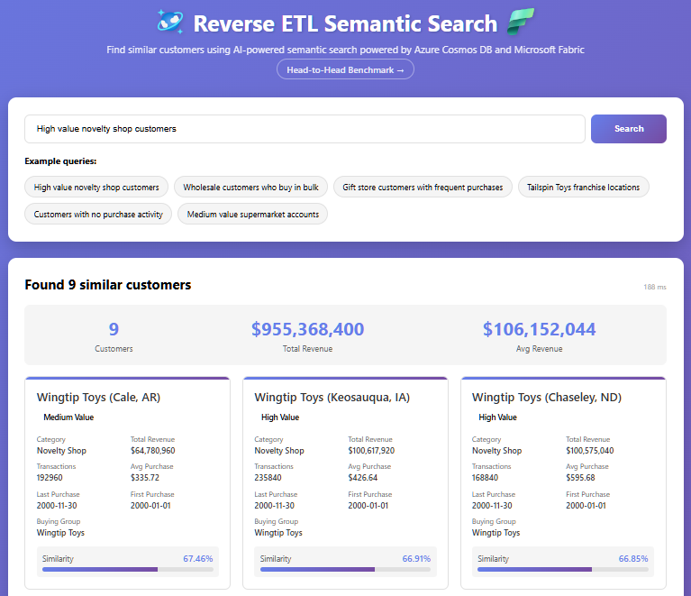
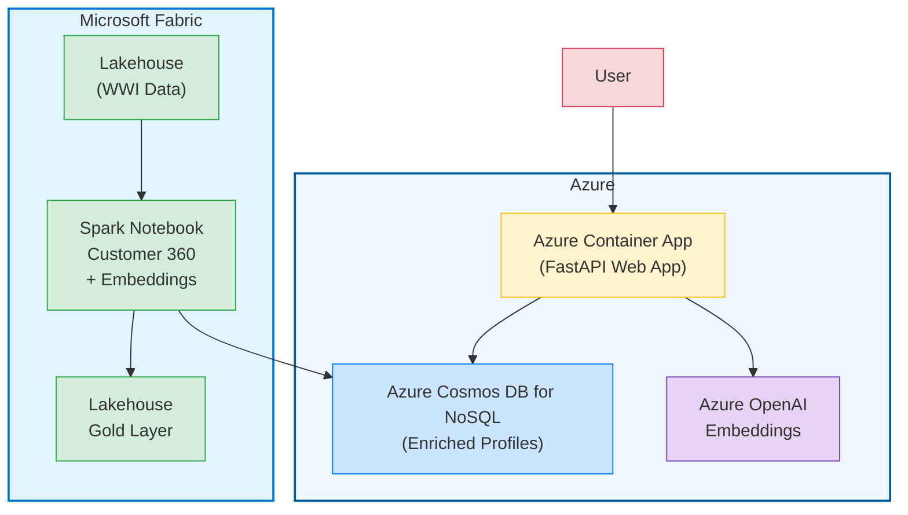

# Customer 360 Reverse ETL

## *Microsoft Fabric + Azure Cosmos DB + Semantic Search*

End-to-end demo that processes transactional sales data in **Microsoft Fabric**, enriches it into **Customer 360 profiles** with AI embeddings, reverse-ETLs the profiles into **Azure Cosmos DB for NoSQL**, and serves a **semantic search web app** over the enriched data.

  

---

## Why This Architecture?

| Layer | Tool | Role |
|---|---|---|
| **Analytical Processing** | Fabric Spark Notebook | Aggregate transactional data (Wide World Importers) into enriched customer profiles — purchase metrics, segmentation, top products |
| **Embedding Generation** | Azure OpenAI (`text-embedding-ada-002`) via Fabric built-in endpoint | Generate 1536-dim vectors on rich customer profile text |
| **Operational Store (Reverse ETL)** | Azure Cosmos DB for NoSQL | Serve enriched profiles + embeddings at low latency for operational workloads |
| **Semantic Search** | FastAPI + Cosmos DB `VectorDistance()` | Natural-language search over customer profiles — "find high-value customers who buy electronics" |

The key insight is **Reverse ETL**: analytical data that starts in the warehouse (aggregated, enriched, embedded) is pushed *back* to an operational database so applications can query it in real time.

---

## User Experience



The web app delivers a **natural-language search interface** over enriched Customer 360 profiles. Users type plain-English queries and instantly see results ranked by vector similarity powered by Azure Cosmos DB vector search.

Each result card surfaces key customer attributes at a glance: **name, customer value segment, total revenue, average transaction value and order count**. A similarity score shows how closely each profile matches the query. Summary stats at the top of the results provide a quick snapshot of the result set — total customers found, aggregate revenue, and average revenue — so users can assess the cohort without scrolling.

The experience is designed to demonstrate a customer-facing app with very fast response tiems but backed by enterprise data: Fabric handles the heavy analytical processing upstream, and Azure Cosmos DB serves the enriched profiles with low latency directly inside an application.

## About the Dataset — Wide World Importers

This demo uses the **Wide World Importers (WWI)** sample dataset available natively in Microsoft Fabric Lakehouses.

🏢 Wide World Importers is a wholesale novelty goods importer and distributor operating from the San Francisco Bay area. As a wholesaler, WWI's customers mostly include companies who resell to individuals. WWI sells to retail customers across the United States including specialty stores, supermarkets, computing stores, tourist attraction shops, and some individuals. WWI also sells to other wholesalers via a network of agents who promote the products on WWI's behalf.

The dataset includes a dimensional model with fact tables (sales transactions) and dimension tables (customers, stock items, cities) that the notebook joins, aggregates, and enriches into Customer 360 profiles.

> **Note:** The WWI dataset contains an "Unknown" placeholder customer (CustomerKey = 0) with ~17 million synthetic transactions generated by SQL Server's `Configuration_PopulateLargeSaleTable` stored procedure for columnstore-index benchmarking. These are **not real business transactions** — the notebook automatically filters them out before any processing.

📖 To learn more about the dataset and how to load it in Fabric, see: [Microsoft Fabric Lakehouse Tutorial — Sample Dataset](https://learn.microsoft.com/fabric/data-engineering/tutorial-lakehouse-introduction#sample-dataset)

---

## Repository Structure

```
fabric-reverse-etl/
├── fabric/                                          # Fabric Spark Notebooks
│   ├── customer360_reverse_etl.ipynb                # Create and enrich customer profiles
├── infra/                                           # Azure deployment (azd/bicep)
├── webapp/                                          # Semantic Search Web App
│   ├── app.py                                       # FastAPI backend
│   ├── static/
│   │   └── index.html                               # Frontend UI
│   ├── requirements.txt                             # Python dependencies
│   ├── .env.example                                 # Configuration template
│   └── .env                                         # Generated local config (git-ignored)
└── .gitignore
```

---

## Part 1 — Fabric Spark Notebook (Reverse ETL)

The notebook reads Wide World Importers data from a Fabric Lakehouse, builds enriched Customer 360 profiles, generates embeddings, and writes everything to Azure Cosmos DB.

### Pipeline Sections

| Section | What It Does |
|---|---|
| **0** | `%%configure` — loads Cosmos DB Spark Connector JARs + Fabric AAD auth config |
| **1a** | `%pip install` — installs `openai` and `azure-cosmos` |
| **1b** | Imports, Azure OpenAI client setup, Cosmos DB config, tenant ID extraction |
| **2** | Reads `dimension_customer`, `fact_sale`, `dimension_city`, `dim_stock_item` from Lakehouse |
| **3** | Aggregates purchase history, top-5 products, segments (High/Medium/Low Value), recency metrics |
| **4** | Creates rich text profiles for each customer (concatenated attributes) |
| **5** | Generates embeddings — Approach 1 (Pandas, ≤1K rows) or Approach 2 (Spark UDF, 10K+ rows) |
| **6** | Prepares data for Cosmos DB (adds `id` field, `last_updated` timestamp) |
| **7** | Reverse ETL — writes enriched profiles + embeddings to Azure Cosmos DB |
| **8** | Saves Gold layer to Lakehouse Delta table |
| **9** | Summary statistics |

### Prerequisites

- **Fabric Workspace** with a capacity (F2 or higher, or Trial capacity)
- **Fabric Lakehouse** with Wide World Importers sample data loaded (see below)
- **Azure subscription** with permission to deploy resources
- **Azure Developer CLI (`azd`)** and **Azure CLI (`az`)** installed
- **Cosmos DB Spark Connector** JARs (loaded via `%%configure`):
  - `com.azure.cosmos.spark:azure-cosmos-spark_3-5_2-12:4.41.0`
  - `com.azure.cosmos.spark:fabric-cosmos-spark-auth_3:1.1.0`

### Provision Azure Resources

Before running the notebook, deploy the Azure Cosmos DB account and related resources using `azd`.

1. From the repo root, sign in and deploy:
   ```bash
   az login
   azd auth login
   azd up
   ```
2. After deployment completes, `azd` generates a `.env` file (typically `webapp/.env`) containing the provisioned resource values.
3. Open the `.env` file and copy the `COSMOS_ENDPOINT` value — you will paste this into the Fabric notebook after importing it.

### Loading Wide World Importers Sample Data into a Lakehouse

The notebook reads four tables from a Fabric Lakehouse. The easiest way to get them is to use the **built-in sample dataset** that ships with every Fabric workspace.

#### Use the Built-in Sample

1. In your Fabric workspace, click **+ New item** → **Lakehouse**
1. Name it (e.g., `wwilakehouse`) and click **Create**
1. Once the Lakehouse opens, click **Start with sample data** in the landing page.
1. Select the **Retail Data Model from Wide World Importers**
1. Fabric will populate the Lakehouse with the **Wide World Importers** dataset — this takes 1–2 minutes
1. When finished, you should see these tables in the **Tables** section:

### Setup — Importing and Connecting the Notebook

#### Step 1: Import the Notebook

1. In your Fabric workspace, click **+ New item** → **Import notebook**
2. Click **Upload** and select the `.ipynb` file from the `fabric/` folder
3. The notebook will appear in your workspace

#### Step 2: Attach the Lakehouse

After importing, the notebook has no Lakehouse attached — you must connect one before running:

1. Open the imported notebook in the Fabric notebook editor
1. In the **Explorer** panel on the left, click **Add data items**
1. From the drop-down select **From OneLake catalog**
1. Choose **Existing Lakehouse** → select the Lakehouse containing your WWI sample data → click **Add**
1. The Lakehouse tables should now appear in the Explorer panel under **Tables**

> ⚠️ The notebook uses `spark.read.table("dimension_customer")` etc. — these resolve against the **default Lakehouse** attached to the notebook. If you have multiple Lakehouses, make sure the one with WWI data is set as the default (right-click → **Set as default**).

#### Step 3: Update Configuration

1. In **Section 1b** (Cell 6), paste the `COSMOS_ENDPOINT` value from the `.env` file created by `azd up` into the notebook `COSMOS_ENDPOINT` variable
2. That's it — the remaining configuration values are set by the notebook

#### Step 4: Run

Run all cells in order (use **Run all** or step through one cell at a time). The pipeline takes approximately 3–5 minutes end to end.

---

## Part 2 — Semantic Search Web App

A FastAPI application that lets users search customer profiles using natural language. Queries are embedded with Azure OpenAI, then matched against Azure Cosmos DB using `VectorDistance()` — all server-side.

> **Tip:** If you ran `azd up` in Part 1, the web app is already deployed as an Azure Container App. You can skip the local setup below and go directly to the Container App URL shown in the `azd` deployment output. The instructions below are for running the app locally during development.

### How It Works

1. User types a query (e.g., *"high value customers who buy electronics"*)
2. FastAPI calls Azure OpenAI to embed the query text → 1536-dim vector
3. FastAPI sends a SQL query to Azure Cosmos DB using `VectorDistance(c.embedding, @embedding)`
4. Azure Cosmos DB ranks and returns the most similar customer profiles
5. Results are displayed in the browser with similarity scores

### Prerequisites

- Python 3.10+
- Azure Cosmos DB endpoint (provisioned by `azd up`)
- Azure OpenAI endpoint + key with `text-embedding-ada-002` deployed
- Customer data already loaded by running the Fabric notebook (Part 1)

### Setup

```bash
cd webapp

# Create virtual environment
python -m venv .venv

# Activate
# Windows:
.venv\Scripts\activate
# macOS/Linux:
source .venv/bin/activate

# Install dependencies
pip install -r requirements.txt

# Configure
cp .env.example .env
# Edit .env with your Cosmos DB and Azure OpenAI credentials
```

### Configuration (`.env`)

```env
# Cosmos DB
COSMOS_ENDPOINT=https://your-cosmos-account.documents.azure.com:443/
COSMOS_DATABASE=Customer360DB
COSMOS_CONTAINER=EnrichedCustomers

# Azure OpenAI
AZURE_OPENAI_ENDPOINT=https://your-openai-resource.openai.azure.com/
AZURE_OPENAI_KEY=your-key-here
OPENAI_EMBEDDING_MODEL=text-embedding-ada-002
OPENAI_API_VERSION=2023-05-15
```

> The app uses `DefaultAzureCredential` for Azure Cosmos DB authentication. Run `az login` before starting the app.

### Run

```bash
python app.py
```

Open [http://localhost:8000](http://localhost:8000) in your browser.

### API Endpoints

| Method | Path | Description |
|---|---|---|
| `GET` | `/` | Frontend UI |
| `POST` | `/api/search` | Semantic search — body: `{"query": "...", "topK": 10}` |
| `GET` | `/api/health` | Health check |
| `GET` | `/api/test-vector` | Diagnostic — tests embedding + VectorDistance round-trip |

---

## Data Flow Architecture Diagram

This diagram shows the data flow from Microsoft Fabric through to Azure services and the web application that serves enriched customer profiles.



## Components

### Microsoft Fabric

- **Lakehouse (WWI Data)**: Source data storage
- **Spark Notebook**: Processing engine for Customer 360 view and embeddings generation
- **Gold Layer**: Curated data layer

### Azure

- **Azure Cosmos DB for NoSQL**: Operational store for enriched customer profiles and vector embeddings
- **Azure OpenAI**: Embedding model endpoint for semantic search
- **FastAPI Web App**: Semantic search application serving enriched profiles

## Data Flow

1. Raw data starts in the Lakehouse (WWI Data)
2. Spark Notebook processes data to create Customer 360 profiles and generates embeddings
3. Enriched profiles are written to **Azure Cosmos DB for NoSQL** and the Gold Layer in the Lakehouse
4. Users interact with the FastAPI web app hosted in Azure
5. User queries are converted to embeddings via Azure OpenAI
6. Vector search in Azure Cosmos DB finds relevant customer profiles

---

## Key Technical Details

### Cosmos DB Vector Search

The web app uses Azure Cosmos DB's native `VectorDistance()` function for server-side vector similarity search — no client-side math or external vector databases required.

```sql
SELECT TOP @topK
    c.customer_name, c.customer_segment, c.total_revenue,
    VectorDistance(c.embedding, @embedding) AS similarity_score
FROM c
ORDER BY VectorDistance(c.embedding, @embedding)
```

### Spark Connector Auth

The Fabric Spark notebook uses `FabricAccountDataResolver` from the `fabric-cosmos-spark-auth_3` JAR for seamless AAD token handling within Fabric.

---

## Sample Queries

Try these in the web app to see semantic search in action:

- *"High value novelty shop customers"*
- *"Customers who haven't purchased recently"*
- *"Medium value gift store customers"*
- *"Top computer store purchasers"*
- *"Customers similar to Tailspin Toys"*
