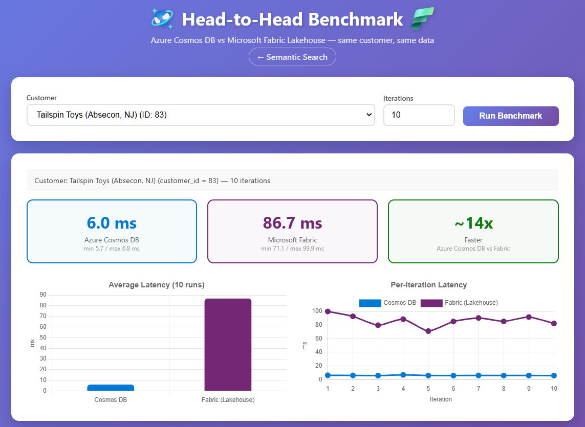
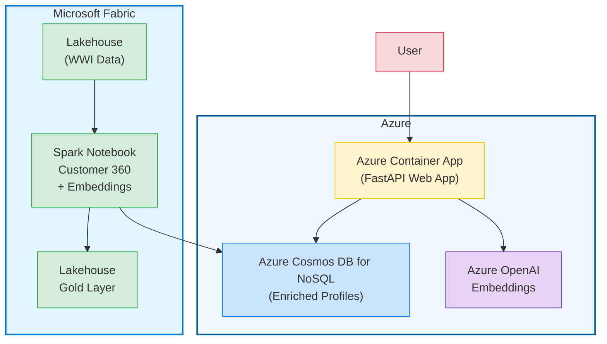

# Customer 360 Reverse ETL

## *Microsoft Fabric + Azure Cosmos DB + Semantic Search*

End-to-end sample that processes transactional sales data in **Microsoft Fabric**, enriches it into **Customer 360 profiles**, uses an LLM to generate natural-language summaries, embeds those summaries with Azure OpenAI, reverse-ETLs everything into **Azure Cosmos DB for NoSQL**, and serves a **semantic search web app** over the enriched data.

  

---

## Why This Architecture?

| Layer | Tool | Role |
|---|---|---|
| **Analytical Processing** | Fabric Spark Notebook | Aggregate transactional data (Wide World Importers) into enriched customer profiles — purchase metrics, segmentation, top products |
| **LLM Enrichment** | Fabric AI Functions (`ai.generate_response`) with **gpt-4.1-mini** | Generate rich natural-language profile summaries that capture each customer's purchasing behavior in context |
| **Embedding Generation** | Azure OpenAI (`text-embedding-3-small`) via Fabric AI Functions (`df.ai.embed`) | Generate 1536-dim vectors on LLM-enriched profiles — fully distributed across Spark. Uses your own Azure OpenAI resource because Fabric only hosts `text-embedding-ada-002` built-in. |
| **Operational Store (Reverse ETL)** | Azure Cosmos DB for NoSQL | Serve enriched profiles + embeddings at low latency for operational workloads |
| **Semantic Search** | FastAPI + Cosmos DB `VectorDistance()` | Natural-language search over customer profiles — "wholesale customers who buy in bulk" |

The key insight is **Reverse ETL**: analytical data that starts in the warehouse (aggregated, enriched, embedded) is pushed *back* to an operational database so applications can query it in real time. This is also a practical necessity — deployed applications in Azure cannot connect directly to Fabric Lakehouse SQL endpoints using managed identity, so Cosmos DB serves as the operational bridge between Fabric's analytical processing and your applications.

---

## User Experience

The web app delivers a **natural-language search interface** over enriched customer profiles. Users type plain-English queries and instantly see results ranked by vector similarity powered by Azure Cosmos DB vector search.

Each result card surfaces key customer attributes at a glance: **name, customer value segment, total revenue, average transaction value and order count**. A similarity score shows how closely each profile matches the query. Summary stats at the top of the results provide a quick snapshot of the result set — total customers found, aggregate revenue, and average revenue — so users can assess the cohort without scrolling.

The experience is designed to demonstrate a customer-facing app with very fast response times but backed by enterprise data: Fabric handles the heavy analytical processing upstream, and Azure Cosmos DB serves the enriched profiles with low latency directly inside an application.


The application also provides a head-to-head comparision for latency. Even if you don't use Azure Cosmos DB's vector search features to do semantic search over analytical data. Cosmos DB can serve data from Microsoft Fabric with extremely low latency. This can be served directly to users or incorporated directly into your applications.

Here are results for a sample query looking up a single customer over the same processed data from Azure Cosmos DB vs. a lakehouse in Microsoft Fabric. Cosmos DB's latency guarantees means you can integrate insights from Microsoft Fabric directly into your operational and transactional workloads that are latency sensitive.



## About the Dataset — Wide World Importers

This demo uses the **Wide World Importers (WWI)** sample dataset available natively in Microsoft Fabric Lakehouses.

🏢 Wide World Importers is a wholesale novelty goods importer and distributor operating from the San Francisco Bay area. As a wholesaler, WWI's customers mostly include companies who resell to individuals. WWI sells to retailers across the United States including specialty stores, supermarkets, and tourist attraction shops. WWI also sells to other wholesalers via a network of agents who promote the products on WWI's behalf.

The dataset includes a dimensional model with fact tables (sales transactions) and dimension tables (customers, stock items, cities) that the notebook joins, aggregates, and enriches into Customer 360 profiles.

📖 To learn more about the dataset and how to load it in Fabric, see: [Microsoft Fabric Lakehouse Tutorial — Sample Dataset](https://learn.microsoft.com/fabric/data-engineering/tutorial-lakehouse-introduction#sample-dataset)

---

## Repository Structure

```
fabric-reverse-etl/
├── fabric/                                          # Fabric Spark Notebooks
│   ├── enrich_data_reverse_etl.ipynb                # Enrich customer profiles with LLM + embeddings, write to Cosmos DB
├── infra/                                           # Azure deployment (azd/bicep)
├── webapp/                                          # Semantic Search Web App
│   ├── app.py                                       # FastAPI backend
│   ├── static/
│   │   ├── index.html                               # Semantic search UI
│   │   └── benchmark.html                           # Head-to-head latency benchmark UI
│   ├── requirements.txt                             # Python dependencies
│   ├── .env.example                                 # Configuration template
│   └── .env                                         # Generated local config (git-ignored)
└── .gitignore
```

---

## Part 1 — Setup and Deployment

### Prerequisites

- **Fabric Workspace** with a capacity (F2 or higher, or Trial capacity)
- **Azure subscription** with permission to deploy resources
- **Azure Developer CLI (`azd`)** and **Azure CLI (`az`)** installed

### Step 1: Provision Azure Resources

Deploy the required Azure infrastructure using `azd`. This provisions:

- **Azure Cosmos DB** account (with vector search container)
- **Azure OpenAI** resource (with `text-embedding-3-small` deployment)
- **Azure Container Registry**
- **Azure Container Apps** environment + app (hosts the web app)
- RBAC role assignments for managed identity access

1. From the repo root, sign in and deploy:

   ```bash
   az login
   azd auth login
   azd up
   ```

1. **Save the Container App URL** shown in the `azd` deployment output (e.g., `https://customer360-app-xxxxx.azurecontainerapps.io`) — this is your deployed web app.
1. After deployment completes, `azd` generates a `.env` file (typically `webapp/.env`) containing the provisioned resource values.
1. Open the `.env` file and copy the `COSMOS_ENDPOINT`, `AZURE_OPENAI_ENDPOINT`, and `AZURE_OPENAI_KEY` values — you will paste these into the Fabric notebook next.

### Step 2: Load Sample Data into a Fabric Lakehouse

The notebook reads four tables from a Fabric Lakehouse. Use the **built-in sample dataset** that ships with every Fabric workspace.

1. In your Fabric workspace, click **+ New item** → **Lakehouse**
1. Name it `wwilakehouse` and click **Create**
1. Once the Lakehouse opens, click **Start with sample data** in the landing page
1. Select the **Retail Data Model from Wide World Importers**
1. Fabric will populate the Lakehouse with the **Wide World Importers** dataset — this takes 1–2 minutes

### Step 3: Import and Configure the Notebook

1. In your Fabric workspace, click **+ New item** → **Import notebook**
2. Click **Upload** and select `enrich_data_reverse_etl.ipynb` from the `fabric/` folder
3. Open the imported notebook and attach the Lakehouse:
   - In the **Explorer** panel on the left, click **Add data items**
   - Select **From OneLake catalog** → choose `wwilakehouse` → click **Add**

> ⚠️ The notebook uses `spark.read.table("dimension_customer")` etc. — these resolve against the **default Lakehouse** attached to the notebook. If you have multiple Lakehouses, make sure the one with WWI data is set as the default (right-click → **Set as default**).

4. In **Section 1b** (the configuration cell), paste the values from the `.env` file:
   - `COSMOS_ENDPOINT` — your Cosmos DB account endpoint
   - `AZURE_OPENAI_ENDPOINT` — your Azure OpenAI resource endpoint
   - `AZURE_OPENAI_KEY` — your Azure OpenAI API key

### Step 4: Run the Notebook

Start a new Standard Session and run all cells in order (use **Run all** or step through one cell at a time). The pipeline takes approximately 3–5 minutes end to end.

The notebook processes data through these stages:

| Section | What It Does |
|---|---|
| **0–1** | Loads Cosmos DB Spark Connector, installs dependencies, configures endpoints |
| **2** | Reads `dimension_customer`, `fact_sale`, `dimension_city`, `dim_stock_item` from Lakehouse |
| **3** | Aggregates purchase history, top-5 products, segments (High/Medium/Low Value), recency metrics |
| **4a** | Creates structured text profiles for each customer |
| **4b** | Computes dataset-level statistics to give the LLM comparative context |
| **4c** | Uses `ai.generate_response()` with **gpt-4.1-mini** (Fabric built-in) to generate natural-language customer profile summaries |
| **5** | Generates embeddings with `text-embedding-3-small` via Fabric AI Functions (`df.ai.embed`) |
| **6–7** | Prepares data and writes enriched profiles + embeddings to Azure Cosmos DB (Reverse ETL) |
| **8** | Saves Gold layer to Lakehouse Delta table |
| **9** | Summary statistics |

---

## Part 2 — Semantic Search Web App

A FastAPI application that lets users search customer profiles using natural language. Query text have embeddings generated by Azure OpenAI, then matched against Azure Cosmos DB using `VectorDistance()` — all server-side.

### Launch the Deployed App

Once the notebook completes, the enriched customer profiles are in Azure Cosmos DB and ready to query. Open the **Container App URL** you saved from the `azd up` output (e.g., `https://customer360-app-xxxxx.azurecontainerapps.io`) in your browser to explore the semantic search app with the fully processed data.

> **Tip:** The web app was already deployed by `azd up` in Part 1. The instructions below are for running the app **locally** during development.

### How It Works

1. User types a query (e.g., *"wholesale customers who buy in bulk"*)
2. FastAPI calls Azure OpenAI (`text-embedding-3-small`) to generate embeddings on the query text
3. FastAPI sends the query to Azure Cosmos DB using its `VectorDistance()` function
4. Azure Cosmos DB ranks and returns the most similar customer profiles
5. Results are displayed in the browser with similarity scores

### Head-to-Head Benchmark

The app includes a benchmark page (`/benchmark`) that compares Azure Cosmos DB latency against a Fabric Lakehouse. Fabric endpoints do not support managed identity authentication so we compare actual Cosmos latency to simulated Fabric latency using historical averages for this data. To run the benchmark with real Fabric data, see the local development instructions in Part 3.

---

## Part 3 — Local Development

The instructions below are for running the web app **locally** for development and debugging.

### Setup

```bash
cd webapp

# Create virtual environment
python -m venv .venv

# Activate
# Windows:
.venv\Scripts\activate
# macOS/Linux:
source .venv/bin/activate

# Install dependencies
pip install -r requirements.txt
```

> The `.env` file was already generated by `azd up` in Part 1 with your Cosmos DB and Azure OpenAI credentials. No need to create or copy it.

### Configuration (`.env`)

```bash
# Cosmos DB
COSMOS_ENDPOINT=https://your-cosmos-account.documents.azure.com:443/
COSMOS_DATABASE=Customer360DB
COSMOS_CONTAINER=EnrichedCustomers

# Azure OpenAI
AZURE_OPENAI_ENDPOINT=https://your-openai-resource.openai.azure.com/
AZURE_OPENAI_KEY=your-key-here
OPENAI_EMBEDDING_MODEL=text-embedding-3-small
OPENAI_API_VERSION=2024-06-01

# Fabric Lakehouse SQL Analytics Endpoint (optional — enables real Fabric benchmark)
# The deployed app simulates Fabric latency because Fabric SQL endpoints don't support
# managed identity. To run the benchmark with real Fabric data locally, add these values.
# Find the SQL endpoint in Fabric portal: Lakehouse > Settings > SQL endpoint
FABRIC_SQL_ENDPOINT=xxxxx.datawarehouse.fabric.microsoft.com
FABRIC_LAKEHOUSE='wwilakehouse'
```

> The app uses `DefaultAzureCredential` for both Azure Cosmos DB and Fabric SQL endpoint authentication. Run `az login` before starting the app.

### Run

```bash
python app.py
```

Open [http://localhost:8000](http://localhost:8000) in your browser.

### API Endpoints

| Method | Path | Description |
|---|---|---|
| `GET` | `/` | Semantic search UI |
| `GET` | `/benchmark` | Head-to-head latency benchmark UI |
| `POST` | `/api/search` | Semantic search — body: `{"query": "...", "topK": 10}` |
| `POST` | `/api/benchmark/cosmos` | Cosmos DB point-read benchmark — body: `{"customerId": 26, "iterations": 5}` |
| `POST` | `/api/benchmark/fabric` | Fabric Lakehouse SQL benchmark (simulated if not configured) |
| `GET` | `/api/customers` | Customer list for benchmark dropdown |
| `GET` | `/api/health` | Health check |
| `GET` | `/api/test-vector` | Diagnostic — tests embedding + VectorDistance round-trip |
| `GET` | `/api/test-fabric` | Diagnostic — tests Fabric SQL endpoint connectivity |

---

## Data Flow Architecture Diagram

This diagram shows the data flow from Microsoft Fabric through to Azure services and the web application that serves enriched customer profiles.



## Components

### Microsoft Fabric

- **Lakehouse (WWI Data)**: Source data storage
- **Spark Notebook**: Processing engine for Customer 360 view and embeddings generation
- **Gold Layer**: Curated data layer

### Azure

- **Azure Cosmos DB for NoSQL**: Operational store for enriched customer profiles and vector embeddings
- **Azure OpenAI**: Embedding model endpoint for semantic search
- **FastAPI Web App**: Semantic search application serving enriched profiles

## Data Flow

1. Raw data starts in the Lakehouse (WWI Data)
2. Spark Notebook processes data to create Customer 360 profiles and generates embeddings
3. Enriched profiles are written to **Azure Cosmos DB for NoSQL** and the Gold Layer in the Lakehouse
4. Users interact with the FastAPI web app hosted in Azure
5. User queries are converted to embeddings via Azure OpenAI
6. Vector search in Azure Cosmos DB finds relevant customer profiles

---

## Key Technical Details

### Cosmos DB Vector Search

The web app uses Azure Cosmos DB's native `VectorDistance()` function for server-side vector similarity search — no client-side math or external vector databases required.

```sql
SELECT TOP @topK
    c.customer_name, c.customer_segment, c.total_revenue,
    VectorDistance(c.embedding, @embedding) AS similarity_score
FROM c
ORDER BY VectorDistance(c.embedding, @embedding)
```

### Spark Connector Auth

The Fabric Spark notebook uses `FabricAccountDataResolver` from the `fabric-cosmos-spark-auth_3` JAR for seamless AAD token handling within Fabric.

---

### Why Reverse ETL (and Not Direct Queries)?

Fabric Lakehouse SQL Analytics Endpoints do not support managed identity or service principal authentication — only interactive user identity (e.g., `az login`). This means deployed applications **cannot query Fabric directly** without workarounds like token proxies or service principal hacks.

Reverse ETL solves this cleanly: enrich and embed data in Fabric, then push the results to Azure Cosmos DB where applications can query with **managed identity, low latency, and no auth complications**. The analytical platform does what it's best at (processing), and the operational database does what it's best at (serving).
