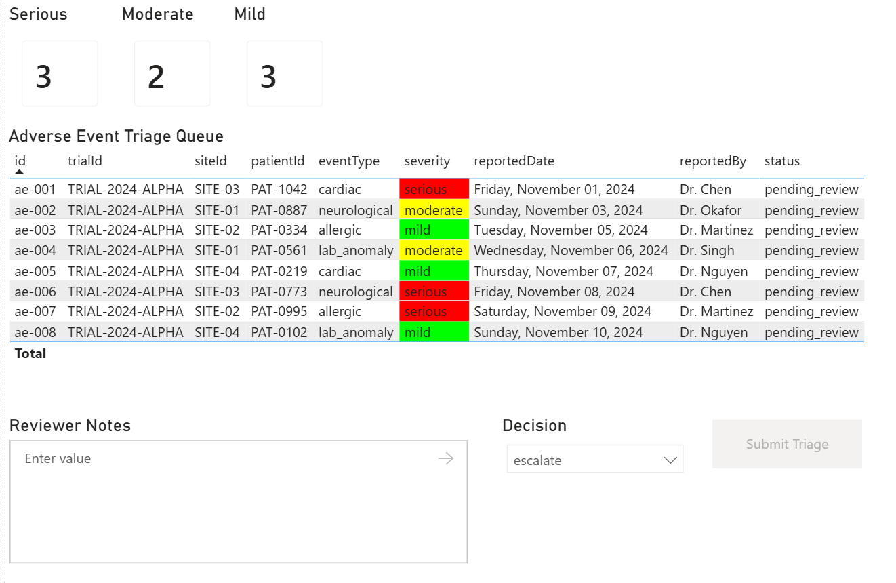

# Translytical Task Flows — Clinical Trial Adverse Event Triage

This sample demonstrates a **translytical task flow** using Cosmos DB in Microsoft Fabric as the operational data store, combined with Power BI and User Data Functions (UDFs) to enable real-time triage decisions from an analytics dashboard.

> **Why this sample is different from a SQL write-back sample:** Every aspect of the write-back in this sample exploits capabilities that are unique to Cosmos DB's schema-agnostic document model. The data cannot be stored cleanly in a relational table without nullable column sprawl, EAV patterns, or schema migrations. See [Why Cosmos DB?](#why-cosmos-db) below for a detailed explanation.

---

## Scenario

A clinical trial safety officer monitors incoming **adverse event reports** across multiple trial sites. Events arrive with different clinical detail depending on their type — cardiac events include ECG findings and troponin levels, neurological events include GCS scores and MRI results, allergic reactions include allergen identification and epinephrine administration, and lab anomalies include multi-value result sets with normal-range comparisons.

The officer views a **Power BI triage queue**, selects an event, enters a decision, and clicks **Submit Triage**. A UDF appends a richly structured, **event-type-specific follow-up protocol** to the event's `reviewLog` array in Cosmos DB — with zero schema changes required as new event types are introduced.



---

## Architecture

```
┌──────────────────────────────────────────────────────────────────┐
│                        Microsoft Fabric                          │
│                                                                  │
│   ┌──────────────────┐   Cosmos DB    ┌──────────────────────┐   │
│   │    Power BI      │◀──connector ───│  Cosmos DB in Fabric │   │
│   │ Triage Dashboard │                │                      │   │
│   │                  │                │  Mixed-schema docs   │   │
│   │  • Event queue   │                │  in one container    │   │
│   │  • Severity KPIs │                │                      │   │
│   │  • Submit Triage │                └──────────────────────┘   │
│   └────────┬─────────┘                          ▲                │
│            │ button click                        │ patch_item()  │
│            ▼                                     │               │
│   ┌─────────────────┐                            │               │
│   │  User Data Func │────────────────────────────                │
│   │ triage_writeback│                                            │
│   └─────────────────┘                                            │
└──────────────────────────────────────────────────────────────────┘
```

### How the data flows

Power BI **reads** directly from Cosmos DB in Fabric using the **Azure Cosmos DB connector** in Import mode. Power Query flattens the top-level scalar fields of each document — the common header fields shared by all adverse event types — into a tabular dataset. The rich type-specific nested detail (cardiac findings, lab values, etc.) is not needed by the report and stays in Cosmos DB.

Power BI **writes back** through a UDF. When a reviewer clicks **Submit Triage**, Power BI invokes the `triage_writeback` UDF, which uses Cosmos DB's patch API to atomically append a type-specific follow-up protocol to the operational document. UDFs are action functions — they are not used as data sources for Power BI visuals.

---

## Why Cosmos DB?

This sample demonstrates three Cosmos DB capabilities that have **no clean SQL equivalent**:

### 1. Schema-Agnostic Write-Back

When the safety officer submits a triage decision, the UDF appends a `followUpProtocol` subdocument to the event's `reviewLog`. The structure of that subdocument is **different for every event type**:

| Event Type | `followUpProtocol` shape |
|---|---|
| `cardiac` | `{ ecgRepeatRequired, cardiologyReferral, troponinRepeatDays, activityRestriction }` |
| `neurological` | `{ neurologistReferral, mriRequired, nihssMonitoring, seizurePrecautions }` |
| `allergic` | `{ allergySpecialistReferral, rechallengeForbidden, safetyReportingRequired }` |
| `lab_anomaly` | `{ repeatLabDays, additionalPanelsRequired, hepatologyReferral, doseReduction }` |

Below are complete examples of the `reviewLog` entry appended for each event type. These samples assume a decision of `escalate` submitted by Dr. Santos:

**Cardiac — escalate**
```json
{
  "reviewedBy": "dr.santos@contoso.com",
  "reviewedAt": "2024-11-10T14:32:00Z",
  "decision": "escalate",
  "notes": "Troponin trending upward, needs cardiology consult",
  "followUpProtocol": {
    "type": "cardiac_follow_up",
    "ecgRepeatRequired": true,
    "cardiologyReferral": true,
    "troponinRepeatDays": 2,
    "activityRestriction": true,
    "scheduledFollowUpDate": "2024-11-10",
    "holdStudyDrug": false
  }
}
```

**Neurological — escalate**
```json
{
  "reviewedBy": "dr.santos@contoso.com",
  "reviewedAt": "2024-11-10T14:35:00Z",
  "decision": "escalate",
  "notes": "GCS dropped, MRI and neuro consult required",
  "followUpProtocol": {
    "type": "neurological_follow_up",
    "neurologistReferral": true,
    "mriRequired": true,
    "nihssMonitoring": true,
    "gcsMonitoringFrequencyHours": 4,
    "seizurePrecautions": true,
    "holdStudyDrug": true
  }
}
```

**Allergic — escalate**
```json
{
  "reviewedBy": "dr.santos@contoso.com",
  "reviewedAt": "2024-11-10T14:40:00Z",
  "decision": "escalate",
  "notes": "Reaction spreading, need allergy specialist evaluation",
  "followUpProtocol": {
    "type": "allergic_follow_up",
    "allergySpecialistReferral": true,
    "epiPenPrescribed": true,
    "skinTestRequired": true,
    "rechallengeForbidden": true,
    "antihistamineContinued": true,
    "holdStudyDrug": true,
    "safetyReportingRequired": true
  }
}
```

**Lab Anomaly — escalate**
```json
{
  "reviewedBy": "dr.santos@contoso.com",
  "reviewedAt": "2024-11-10T14:45:00Z",
  "decision": "escalate",
  "notes": "Liver enzymes 3x ULN, hepatology referral needed",
  "followUpProtocol": {
    "type": "lab_follow_up",
    "repeatLabDays": 3,
    "additionalPanelsRequired": true,
    "hepatologyReferral": true,
    "doseReduction": false,
    "holdStudyDrug": false,
    "fastingRequired": true,
    "patientDietaryGuidance": true
  }
}
```

In a SQL database, storing these varying structures would require either:

- A single wide table with ~20 nullable columns (most null on every row)
- An EAV (Entity-Attribute-Value) table — losing all type safety and query performance
- Four separate event-type tables — requiring joins and a redesign every time a new event type is introduced

In Cosmos DB, each document stores exactly the fields it needs. Adding a new event type requires **zero database schema changes** — only a new branch in the UDF.

### 2. Atomic Array Append via Partial Document Update

The UDF uses Cosmos DB's [Partial Document Update (patch) API](https://learn.microsoft.com/azure/cosmos-db/partial-document-update) to atomically append to the `reviewLog` array:

```python
patch_operations = [
    {"op": "add", "path": "/reviewLog/-", "value": review_entry},
    {"op": "replace", "path": "/status", "value": new_status}
]
container.patch_item(item=eventId, partition_key=trialId, patch_operations=patch_operations)
```

This operation is atomic and does **not require reading the full document first**. SQL has no equivalent — to append to a stored array in SQL you must `SELECT`, deserialize, modify, and `UPDATE` in separate round trips.

### 3. Mixed `docType` in a Single Container

The same container holds documents of different types (`adverseEvent`, `patient`, `trialProtocol`) with no shared schema requirement. Power Query selects only the common header fields that all adverse events share. The rich type-specific clinical detail stays nested in Cosmos DB, ready for write-back, without cluttering the analytics layer.

---

## Prerequisites

- Microsoft Fabric workspace with Fabric capacity (F2 or higher)
- Cosmos DB database created in Fabric
- Power BI Desktop (with Translytical Task Flows preview enabled)
- The following tenant settings enabled in Fabric Admin Portal:
  - **User Data Functions** — enabled
  - **Translytical task flows** — enabled

---

## Setup

### Step 1 — Create the Cosmos DB Database in Fabric

1. In your Fabric workspace, select **+ New Item** and choose **Azure Cosmos DB**.
2. Name your database `ClinicalTrialDB` and select **Create**.
3. Open the database and create a new container:
   - **Container name:** `ClinicalTrialData`
   - **Partition key:** `/trialId`
4. From **Settings > Connection**, copy the **Cosmos DB URI** — you will need it for the UDF and for Power BI.

### Step 2 — Load the Sample Data

1. In your Fabric workspace, open the **ClinicalTrialDB** Cosmos DB item.
2. In the **Data Explorer**, expand the **ClinicalTrialDB** database and select the **ClinicalTrialData** container.
3. Click **Upload Item** at the top of the Data Explorer pane.
4. Browse to `adverse_events_sample_data.json` from this repository and upload it.

### Step 3 — Create the Triage Write-Back UDF

1. In your Fabric workspace, select **+ New Item > User Data Functions**.
2. Name it `triage_writeback`.
3. Select **New function** and replace the default code with the contents of `triage_writeback_udf.py`.
4. Replace the placeholders:
   - `YOUR_COSMOS_DB_URI_HERE` → your Cosmos DB URI from Step 1
5. In **Library Management**, add `azure-cosmos` from PyPI.
6. Select **Publish**.

### Step 4 — Configure Power BI

#### Connect to Cosmos DB

Power BI connects directly to Cosmos DB in Fabric using the Azure Cosmos DB connector. Both Import and Direct Query modes work with UDFs, but Import is a good fit here because the triage dataset is small and infrequently changing — giving fast interactivity without the overhead of live queries on every visual interaction. The connector reads documents and Power Query flattens the top-level fields into columns, giving Power BI the tabular structure it needs while leaving the nested detail untouched in Cosmos DB.

1. In Power BI Desktop, select **Get Data > More**, search for **Cosmos DB**, and select **Azure Cosmos DB v2**.
2. Enter your Cosmos DB URI from Step 1 and select **OK**.
3. When prompted for credentials, select **Organizational account**, sign in with your Entra ID account, and select **Connect**.
4. In the Navigator, expand `ClinicalTrialDB`, expand `ClinicalTrialData`, and check the box next to `ClinicalTrialData`.
5. Select **Transform Data** to open Power Query before loading.

#### Flatten the Documents in Power Query

The Cosmos DB v2 connector automatically expands the top-level fields of each document into individual columns. Use Power Query to remove the nested fields that aren't needed by the report:

1. In Power Query, hold **Ctrl** and click each of the following column headers to select them:
   - `id`, `trialId`, `patientId`, `siteId`, `eventType`, `severity`, `status`, `reportedDate`, `reportedBy`
2. Right-click any of the selected column headers and choose **Remove Other Columns**.
3. Rename the query to `AdverseEvents`.
4. Select **Close & Apply**.

> **Why we exclude the nested fields:** Fields like `cardiacDetails`, `neurologicalDetails`, and `reviewLog` have different shapes per document type and cannot be meaningfully flattened into Power BI columns. They don't need to be — the report only needs the common header fields for the triage queue. The full nested detail is preserved in Cosmos DB and is what makes the write-back valuable.

#### Create the ReviewerName Measure

The button needs the currently signed-in user's identity to pass as the `reviewerName` parameter. Create a DAX measure to expose this:

1. In the **Data** pane, select the `TriageDecisions` table. (Measures must be associated with a table in Power BI — `TriageDecisions` is a convenient home for it even though the measure doesn't reference any table data.)
2. Go to **Home > New Measure**.
3. Enter the following DAX formula and press **Enter**:

   ```dax
   ReviewerName = USERPRINCIPALNAME()
   ```

> **Note:** In Power BI Desktop, `USERPRINCIPALNAME()` returns your local account email. When the report is published to the Power BI service, it returns the UPN of the signed-in user viewing the report.

#### Build the Report

The report consists of three visuals:

**Visual 1 — Triage Queue Table**

- Select the table visual, open the **Format** pane, expand **Title**, toggle it **On**, and enter `Adverse Event Triage Queue`.
- Fields: `id`, `trialId`, `siteId`, `patientId`,  `eventType`, `severity`, `reportedDate`, `reportedBy`, `status`
- For `reportedDate`, click the dropdown arrow next to the field in the **Columns** well and select **reportedDate** instead of **Date Hierarchy** so it displays as a flat date value.
- Apply conditional formatting on `severity` to color-code by severity level:
  1. In the table visual, right-click the `severity` column header and select **Conditional formatting > Background color**.
  2. In the dialog, set **Format style** to **Rules**.
  3. Add three rules:
     - If value **equals** `serious` then color **red** (e.g., `#FF4444`)
     - If value **equals** `moderate` then color **yellow** (e.g., `#FFD700`)
     - If value **equals** `mild` then color **green** (e.g., `#44BB44`)
  4. Select **OK**.
- Filter `status` to exclude closed events: in the **Filters** pane, expand `status`, select **Advanced Filtering**, set the condition to **does not contain** with a value of `closed`, and select **Apply filter**.

**Visual 2 — Severity Cards**

Create three Card visuals, one for each severity level (`serious`, `moderate`, `mild`):

1. Add a **Card (classic)** visual to the canvas. (Power BI Desktop defaults to the new Card visual, which has different field wells. Select the dropdown arrow on the Card icon in the Visualizations pane and choose **Card (classic)** to match these instructions.)
2. Drag the `id` field into the card's **Value** well.
3. Click the dropdown on `id` in the **Value** well and change the aggregation to **Count**.
4. In the **Format** pane, expand **Callout value** and set **Label** to **Off**.
5. Expand **Title**, toggle it **On**, and enter the severity name (e.g., `Serious`, `Moderate`, or `Mild`).
6. In the **Filters** pane, drag `severity` from the Fields list into the **Filters on this visual** section. Check only the matching value (e.g., `serious` for the first card).
7. Also drag `status` into **Filters on this visual**, select **Advanced Filtering**, set **does not contain** with value `closed`, and select **Apply filter**.
8. Repeat for the other two severity levels (`moderate`, `mild`).

**Visual 3 — Triage Action Panel**

- An **input slicer** for reviewer notes (single value, used as a parameter). After adding the slicer, select it, open the **Format** pane, expand **Slicer settings > Title**, toggle it **On**, and enter `Review Notes`.
- A **list slicer** for decision with four values: `monitor`, `escalate`, `hold_drug`, `close`. These values are not in the Cosmos DB data — they are triage actions the reviewer chooses. To create the slicer:
  1. In Power BI Desktop, select **Home > Enter Data**.
  2. Name the column `Decision` and enter four rows: `monitor`, `escalate`, `hold_drug`, `close`.
  3. Name the table `TriageDecisions` and select **OK**.
  4. From the **File** menu, select **Close & Apply** to load the table into the model.
  5. Add a **Slicer** visual to the canvas and drag the `Decision` field from the `TriageDecisions` table into its **Field** well.
  6. To display as a dropdown instead of a list: select the slicer, open the **Format** pane, expand **Slicer settings > Options**, and change **Style** to **Dropdown**.
- A **Submit Triage** button:
  - Go to **Insert > Buttons > Blank** to add a blank button to the report.
  - Select the button and in the **Format** pane, expand **Button > Text**, toggle it **On**, and enter `Submit Triage`.
  - Enable **Action** on the button
  - Set type to **Data Function**
  - Select workspace, UDF: `triage_writeback`, function: `triage_adverse_event`
  - Map parameters: (for conditional values, click the fx button and select the table and column)
    | Parameter | Source |
    |---|---|
    | `trialId` | Conditional value → `SELECTEDVALUE(AdverseEvents[trialId])` |
    | `eventId` | Conditional value → `SELECTEDVALUE(AdverseEvents[id])` |
    | `eventType` | Conditional value → `SELECTEDVALUE(AdverseEvents[eventType])` |
    | `reviewerName` | Conditional value → `SELECTEDVALUE(TriageDecisions[ReviewerName])` |
    | `decision` | Conditional value → `SELECTEDVALUE(TriageDecisions[Decision])` |
    | `notes` | Slicer value → Reviewer Notes |

### Step 5 — Save and Publish the Report

Save the report and publish it to your Fabric workspace before testing the Submit Triage button:

1. Select **File > Save As** and save the report.
2. Select **Home > Publish** and choose your Fabric workspace.
3. Open the report in the Fabric portal and test the button from there.

> **Known issue:** If you test the Submit Triage button in Power BI Desktop, you may see an error dialog: *"An error occurred while rendering the report"* with a JavaScript `TypeError` in `ExecuteDataFunctionStandardizedEventBuilder`. This is a telemetry logging bug in Power BI Desktop — the UDF executes successfully despite the error. You can safely ignore this error in Desktop, but for a clean experience, test from the published report in Fabric.

---

## What Happens After You Click Submit

When a reviewer selects an event row and clicks **Submit Triage**:

1. Power BI calls the `triage_adverse_event` UDF with the selected parameters.
2. The UDF determines the `eventType` and constructs a **type-specific** `followUpProtocol` subdocument.
3. Cosmos DB's patch API atomically appends the full review entry (including the follow-up protocol) to the document's `reviewLog` array.
4. The document's `status` field is updated in the same patch operation.
5. Power BI's dataset refreshes — the event's updated status is reflected in the triage queue.

To see the full document as stored in Cosmos DB — including the type-specific nested subdocument that Power BI never needs to render — open the **Data Explorer** in your Cosmos DB in Fabric item and run:

```sql
SELECT * FROM c WHERE c.id = "ae-001"
```

---

## Project Structure

```
translytical-clinical-triage/
├── adverse_events_sample_data.json   # 8 mixed-schema sample documents
├── triage_writeback_udf.py           # Write-back UDF with schema-aware patch
└── README.md
```

---

## Key Cosmos DB APIs Used

| API | Used For |
|---|---|
| `container.patch_item()` | Atomic array append to `reviewLog` + status update |
| Azure Cosmos DB v2 connector | Direct read from Cosmos DB into Power BI via Power Query |

---

## Related Samples

- [Translytical Task Flows — Product Pricing](../translytical-taskflows/README.md)
- [Cosmos DB in Microsoft Fabric](https://learn.microsoft.com/fabric/database/cosmos-db/overview)
- [Python CRUD Fundamentals for Cosmos DB in Fabric](https://learn.microsoft.com/samples/azurecosmosdb/cosmos-fabric-samples/python-crud-fundamentals/)
- [User Data Functions](https://learn.microsoft.com/samples/azurecosmosdb/cosmos-fabric-samples/user-data-functions/)
